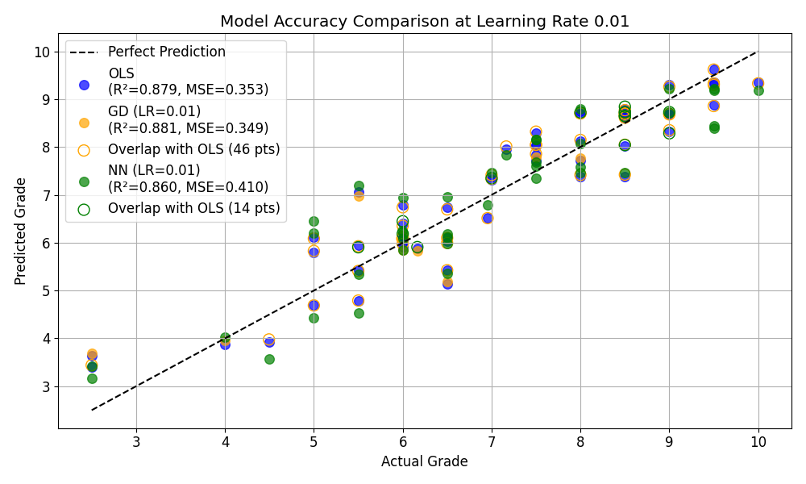

# Student Grade Prediction Model

A Python research project comparing ordinary least squares, linear regression with gradient descent, and a neural network for predicting student grades from screen-time, health, and academic variables.

Created by Aarib Sarker for a mathematics extended essay investigating how gradient descent affects convergence, predictive accuracy, and training time in linear regression and neural networks. The project implements gradient descent and backpropagation in NumPy and uses scikit-learn for the ordinary least squares baseline and evaluation metrics.

## Experiment

With the included spreadsheet, the pipeline filters 4,115 raw records into 269 complete samples, selects seven features, standardizes the inputs, and uses an 80/20 train/test split (215 training samples and 54 test samples) with `random_state=42`. The original essay and résumé report 4,116 records and 263 usable samples; those counts differ from the included data and current filtering code.

It evaluates **13 configurations**:

- One ordinary least squares (OLS) baseline using `LinearRegression`.
- Six NumPy linear regression models trained with gradient descent (GD).
- Six NumPy neural networks (NN) trained with backpropagation.

GD and NN use learning rates of `0.001`, `0.01`, `0.1`, `0.5`, `0.75`, and `1`. Each configuration is run five times and its metrics are averaged; OLS is run once. Evaluation includes mean squared error (MSE), the coefficient of determination (R²), compute time, and training loss curves. Repeated runs use the same split and fixed initialization, so they primarily measure timing variation.

## Historical results

The checked-in [results summary](charts/results_summary.csv) reports:

| Model | Learning rate | Test R² | Test MSE | Compute time (s) |
| --- | --- | --- | --- | --- |
| Ordinary least squares | — | 0.8792 | 0.3526 | 0.005519 |
| Gradient descent | 0.01 | **0.8806** | **0.3487** | 0.018000 |
| Neural network | 0.01 | 0.8597 | 0.4096 | 0.193472 |

In these saved results, gradient descent at a learning rate of 0.01 achieved approximately **0.881 R²** and trained about **10.7 times faster** than the network at the same learning rate. These are results from this experiment, rather than a general ranking of the methods; timing depends on hardware and software.



**Reproducibility note:** the current `models/nn.py` differs from the network described in the essay and represented by the saved results. It uses two hidden units, 30 epochs, a sigmoid output, L2 regularization, and strong gradient clipping. The essay describes ten hidden units, up to 2,000 epochs, early stopping, and a linear output. Running the current code will therefore produce different neural-network results and overwrite the generated charts and summary. The historical artifacts are retained for reference.

## Run locally

Use Python 3.12 or newer. From the repository root, create and activate a fresh virtual environment:

```bash
python3 -m venv .venv
source .venv/bin/activate
```

On Windows, use `python -m venv .venv` and activate it in PowerShell with `.venv\Scripts\Activate.ps1`.

Install dependencies and run the comparison:

```bash
python -m pip install -r requirements.txt
python models/run.py
```

The script loads `data/data.xlsx`, trains all configurations, and writes plots and `results_summary.csv` to `charts/`. Input and output paths are resolved relative to the scripts, so they do not depend on your working directory.

For a machine without a display:

```bash
MPLBACKEND=Agg python models/run.py
```

You can also run individual models:

```bash
python models/ols.py
python models/regression.py
python models/nn.py
```

The OLS script displays a scatter plot. The other two print their evaluation results.

## Data and preprocessing

The essay identifies the dataset as *Screen Exposure and School Performance in Adolescents from Argentina* by Susana Rodríguez et al. (2021), Mendeley Data, dataset identifier `pj9hzmp7ym`, version 1.

The loader reads worksheet `Hoja1`, keeps rows where `excluFINAL == 1`, and drops rows missing the target (`prom`) or any selected feature. Original dataset column names are preserved:

| Column | Role |
| --- | --- |
| `tpopantallatotalhs` | Screen-time feature |
| `WATCHTVbedtime7D01` | Bedtime television-use feature |
| `COMPUbedtime1D01` | Bedtime computer-use feature |
| `COMPUbedtime2D01` | Bedtime computer-use feature |
| `BMIzscoreCAT` | BMI category feature |
| `matematica` | Mathematics performance feature |
| `aplazos` | Academic failure feature |
| `prom` | Target: average grade |

Consult the source dataset for the exact coding of each variable. The inputs include existing academic performance, so the results should not be interpreted as prediction from screen time alone or evidence that screen time causes changes in grades.

## Repository layout

```text
.
├── README.md
├── requirements.txt
├── data/
│   └── data.xlsx
├── models/
│   ├── data_utils.py       # Dataset filtering, scaling, and train/test split
│   ├── ols.py              # Scikit-learn ordinary least squares baseline
│   ├── regression.py       # NumPy gradient descent with early stopping
│   ├── nn.py               # NumPy neural network and backpropagation
│   └── run.py              # Model comparison, charts, and summary export
├── charts/                # Saved plots and results_summary.csv
└── processed-data/
    ├── combined_results.csv
    └── processor.py        # Legacy result-combination utility
```

`processed-data/processor.py` belongs to an earlier workflow. It expects `Linear-Regression/results.csv` and `Neural-network/results_nn.csv`, which are not included in this repository. It is not needed for `models/run.py`; the adjacent combined CSV is a historical artifact. Additional saved charts, including the stable and unstable network plots, are not all regenerated by the current runner.

## Methodological limitations

- The current loader fits `StandardScaler` before splitting the data, allowing information from the test inputs into preprocessing. A future evaluation should split first and fit the scaler on training data only.
- There is one fixed train/test split and no cross-validation. Comparing learning rates on this test set does not provide an independent final evaluation of a selected model.
- The current network constrains predictions to the interval from 0 to 1 without scaling the target grades, limiting its suitability for this regression task.
- The plotted comparison uses a fixed learning rate of 0.01; the runner does not automatically select the best configuration.

This repository documents an educational optimization experiment. The saved results and the current implementation should be evaluated with these limitations in mind.
